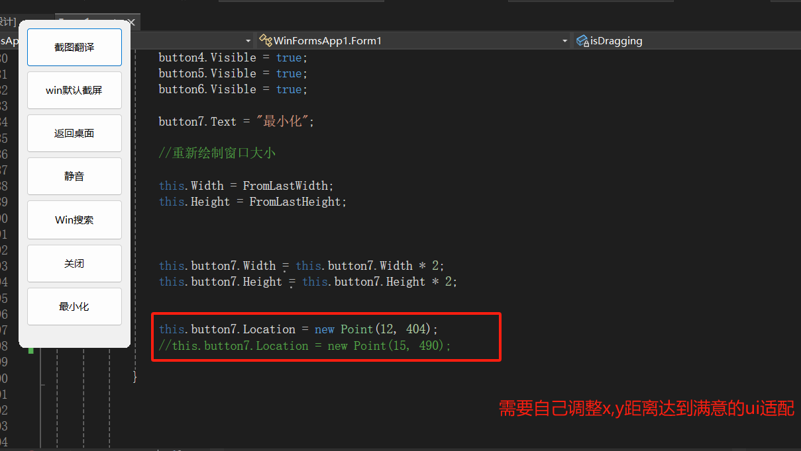

# win平板桌面快捷操作 悬浮工具栏

#### 介绍

给富士通q508 win平板快捷键操作使用的 其他win平板需要自己调整ui适配问题

使用wifrom 调用win32api 模拟按键和 NAudio控制扬声器声音

可以自己diy添加想要的快捷键组合

后续有时间改为 h5使用electron打包成桌面应用

#### 软件架构

软件架构说明

#### 安装教程

1. xxxx
2. xxxx
3. xxxx

#### 使用说明

xxxx

1. xxxx
2. 

#### 参与贡献

1. Fork 本仓库
2. 新建 Feat_xxx 分支
3. 提交代码
4. 新建 Pull Request

#### 特技

1. 使用 Readme\_XXX.md 来支持不同的语言，例如 Readme\_en.md, Readme\_zh.md
2. Gitee 官方博客 [blog.gitee.com](https://blog.gitee.com)
3. 你可以 [https://gitee.com/explore](https://gitee.com/explore) 这个地址来了解 Gitee 上的优秀开源项目
4. [GVP](https://gitee.com/gvp) 全称是 Gitee 最有价值开源项目，是综合评定出的优秀开源项目
5. Gitee 官方提供的使用手册 [https://gitee.com/help](https://gitee.com/help)
6. Gitee 封面人物是一档用来展示 Gitee 会员风采的栏目 [https://gitee.com/gitee-stars/](https://gitee.com/gitee-stars/)
